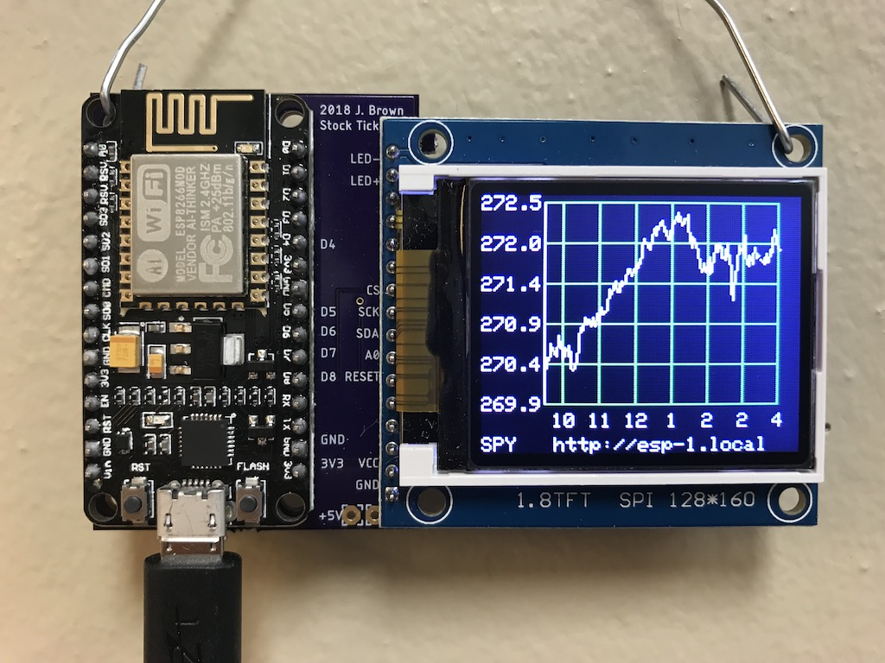

# ESPStockTicker

This project contains the necessary code to retrieve and display stock market prices for a set of stock tickers. It will also display a one day chart for a given stock ticker. It also prints a historical chart for the 10 year Treasury Bill, the WTI Crude Oil price, and Bitcoin price. These can be turned off in the settings page. 

It makes use of the following hardware:

- NodeMCU ESP8266
- ST7735 1.8 TFT 128 160 display
- A custom circuit board (Eagle files included)

OR

- Adafruit Huzzah ESP8266
- ILI9341 2.5" FeatherWing Display
- HX8347 3.5" Featherwing Display

The code can be compiled in the Arduino IDE provided you have installed the board mamanger, by specifing the URL in the additional boards manager url field in preferences. Currently: [http://arduino.esp8266.com/stable/  package_esp8266com_index.json] - the board you select will determine which graphics libraries are used. So if you get compilation errors, make sure you've picked either NodeMCU 1.0 (ESP 12-E Module) or Adafruit Feather Huzzah ESP8266. The size of dispay is determined at runtime based on the chipset.

Build with the following board settings:
- CPU Fequency: 160 Mhz
- Flash Size: 4M (3M SPIFFS)
- lwIP Variant: "v2 Lower Memory"
- VTables: Flash
- SSL Support: All SSL Ciphers (most compatible)

The project makes use of the following libraries (latest version tested):

Board - Use board manager to install
- ESP8266Wifi (2.5.2) - note, if you are upgrading from 2.4.x, make sure to wipe the flash or SPIFFS won't work correctly.

Libraries - Use library manager to install
- ArduinoJson (6.17.2)
- Adafruit BusIO (1.7.1)
- Adafruit ST7735 graphics driver (1.6.0)
- Adafruit ILI9341 graphics driver (1.5.6)
- Adafruit HX8357 graphics driver (1.1.10)
- Adafruit GFX graphics library (1.10.4)
- Arduino OTA (part of ESP8266Wifi)
- elapsedMillis (1.0.6)
- Time (1.6.0)

External APIs
- IEX Trading API for real time stock information (https://iextrading.com/developer/docs/)
- St. Louis Federal Reserve API for Treasury Bill and Oil pricing data (http://fred.stlouisfed.org)
- CoinDesk API for Bitcoin pricing data (https://api.coindesk.com)
- OctoPrint API for OctoPrint status page (expects octopi.local as the host)

# Setup

After compiling the source code and uploading to your ESP, it will restart and begin by looking for known WIFI networks. If it can't connect, it will go into softAP mode and create an adhoc wifi network called esp. You can connect to it and navigate to [http://192.168.4.1/wifi]. This page will allow you to configure your wifi settings. You can add multiple wifi networks.

After you save your changes, the ESP should pick up the new settings and try to connect. Once it is connected, it will display its IP address on the bottom of the screen. Accessing at IP with a browser will bring up the settings page. This page will allow you to specify your stock tickers, the API keys for IEX and Octoprint, and fields to enter the stock tickers to track. The first ticker will be used to print the chart for the day. 

# Eagle Files

If you want to print the PCB, I recommend https://oshpark.com. The PCB is for a NodeMCU ESP8266 and TFT. You won't need one if you use the Adafruit Huzzah board and Featherwings.

[https://github.com/brownjd/ESP8266-TFT-PCB]

# 3D Printed Box

The design for the case is hosted here: [https://cad.onshape.com/documents/baf6f8920e0056c74aa33163/w/9b8db8e1d71b7267bfcf4cd1/e/1de548e62555208ea106f9fa]. This is for the 2.5" screen.

# Building

If you're interested in making changes, you'll notice two static html pages wifi.html and index.html have been gzipped. In fact, these are included as header files and served from PROGMEM. The beauty of this approach is that you don't need a separate filesystem image for SPIFFS. Firmware can be retrieved and loaded as a single transaction. So if you make changes to the html files, you need to run the gulp script to regenerate the hex gzipped files. Simply run 'npm i'. It will pick up the json package file and set up your environment. Then just run gulp from the data directory. Then simply compile the project and it will pick up the gzipped header files.
