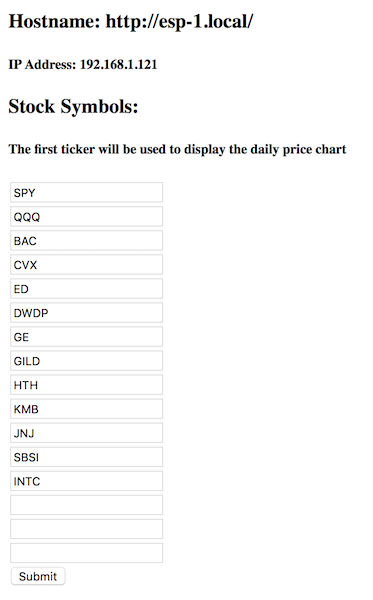

# ESPStockTicker

This project contains the necessary code to retrieve and display stock market prices for a set of stock tickers. It will also display a one day chart for a given stock ticker. 

It makes use of the following hardware:

- NodeMCU ESP8266
- ST7735 1.8 TFT 128 160 display
- A custom circuit board (Eagle files included)

The code can be compiled in the Arduino IDE provided you have installed the board mamanger, by specifing the   URL in the additional boards manager url field in preferences. Currently: [http://arduino.esp8266.com/stable/  package_esp8266com_index.json]

The project makes use of the following libraries (latest version tested):

Board - Use board manager to install
- ESP8266Wifi (2.4.2 - there are problems reported with 2.5.x betas)

Libraries - Use library manager to install
- ArduinoJson (5.13.4)
- Adafruit ST7735 graphics driver (1.2.7)
- Adafruit GFX graphics library (1.3.6)
- Arduino OTA (part of ESP8266Wifi)
- elapsedMillis (1.0.4)

External APIs
- IEX Trading API for real time stock information (https://iextrading.com/developer/docs/)
- St. Louis Federal Reserve API for Treasury Bill pricing data (http://fred.stlouisfed.org)
- CoinDesk API for Bitcoin pricing data (https://api.coindesk.com)

# Setup

After compiling the source code and uploading to your ESP, it will restart and begin by looking for known WIFI networks. If it can't connect, it will go into softAP mode and create an adhoc wifi network called esp. You can connect to it and navigate to [http://esp.local/wifi]. This page will allow you to configure your wifi settings.

After you save your changes, the ESP should pick up the new settings and try to connect. Once it is connected, it will display its mDNS hostname after looking for any name collisions. You can access this URL with a browser on an mDNS aware platform (Linux, Mac OS, IOS). Generally this will be [http://esp.local]. This page will allow you to specify your stock tickers to track. The first ticker will be used to print the chart for the day. 

# Eagle Files

If you want to print the PCB, I recommend https://oshpark.com. 

[https://github.com/brownjd/ESP8266-TFT-PCB]

# 3D Printed Box

The design for the case is hosted here: [https://cad.onshape.com/documents/baf6f8920e0056c74aa33163/w/9b8db8e1d71b7267bfcf4cd1/e/1de548e62555208ea106f9fa]

# Building

If you're interested in making changes, you'll notice two static html pages wifi.html and index.html have been gzipped. In fact, these are included as header files and served from PROGMEM. The beauty of this approach is that you don't need a separate filesystem image for SPIFFS. Firmware can be retrieved and loaded as a single transaction. So if you make changes to the html files, you need to run the gulp script to regenerate the hex gzipped files. Simply run 'npm i'. It will pick up the json package file and set up your environment. Then just run gulp.
